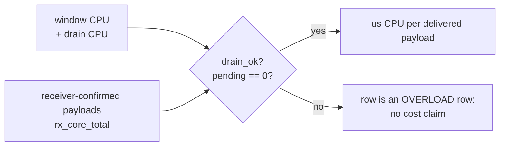

# Scaling to 1000 destinations: pre-registered protocol

Status: **protocol frozen before measurement.** Rows are appended as they are
measured; the stopping condition and the target are fixed here, not adjusted
after seeing results.

## Question

PR #116 established that one shared-Owner shard carries a bounded, *reconciling*
load and that it saturates somewhere around 150-200 destinations at 8 Mbps per
destination on this host (6 CPUs, `K=256` TX lanes). It did **not** establish a
path to the 1000-destination tier, and it explicitly refused to claim one from
single-shard rows.

This document asks the follow-up: **is 1000 destinations reachable on this host,
and what is the per-destination cost of getting there?**

Two outcomes are acceptable and they mean different things:

1. **Sharded scaling.** Total capacity rises with shard count and the
   per-destination cost stays flat, so 1000 destinations are served by S shards
   of ~1000/S destinations each. This is the deployment-relevant answer for
   Restream (process-per-shard is already the deployment shape).
2. **Single-shard scaling.** One shard carries 1000 destinations because the
   per-destination cost falls. This is the stronger engineering claim and is
   only accepted with a profile-backed explanation of what was removed.

Either outcome needs the same evidence: per-shard reconciliation, no starved
destination, and a per-copy cost that does not grow superlinearly with F.

## Topology (fixed)

- **One destination = one UDP port**, contiguous range `[base, base + N)`.
  Sender caller `i` sends to `base + i`; receiver connection `i` binds
  `base + i` (`cfg.port + i`, `crates/srt-bench/src/lib.rs`).
- **Sender shard `s` of S** owns `[base + s*(N/S), base + (s+1)*(N/S))`, run as
  `compio_shared_owner_qual --fanout N/S --base-port <shard base>`.
- **Receiver shard `r` of R** binds `<shard base>` with `--connections N/S`
  (`srt-bench runtime=compio mode=receiver <port> <duration> 120 --connections M`).
- One receiver process per sender shard, on the same host, separate processes.
- Nothing in the loop is allowed to be shared across shards: no cross-shard
  listener socket, no cross-shard scheduling, no global allocator.

The one-port-per-destination rule is a real constraint of the instrument, not a
preference: several senders sharing a single destination port do not all get
admitted (measured once: `connections=3 established=1 data_zero=2`). That is out
of model here and is not investigated in this document.

## Metrics (all from the harness's own STATS/SHARED_OWNER_QUAL lines)

| Metric | Definition | Why this one |
|---|---|---|
| `us_per_copy` | `(cpu_user_ms + cpu_sys_ms) * 1000 / copies` | Normalizes scheduler jitter out; the per-copy cost is the thing that decides whether 1000 is reachable |
| `copies_per_s` | `data_accepted / elapsed_s` (sender), `core_total / elapsed_s` (receiver) | Shard capacity |
| `data_zero` | destinations that received **zero** DATA | Aggregates hide starvation; new field |
| `data_below_half_mean` | destinations below half the mean | Detects a slow subset the total cannot show |
| `data_min` / `data_p50` / `data_max` | per-destination delivered DATA | Spread of service across destinations |
| `established` vs `connections` | admitted destinations | Partial admission looks like throughput loss unless printed |
| `sec_a` | receiver loss | Any nonzero value fails the row |
| `missed_source_ticks` | source cadence slots not offered | The sender's own honesty counter |
| `syscalls/copy` | from `srt-bench sysprof` | Separates I/O-bound from CPU-bound |

The distribution fields (`data_min`, `data_p50`, `data_max`, `data_zero`,
`data_below_half_mean`) are new in this branch: computing them post-run costs one
sort of a per-connection vector at teardown and no datapath work.

## Fixed target

**T1 - scaling target.** 1000 destinations served with, per shard:

```text
established == connections          (no shard partially admits its range)
data_zero == 0                      (no starved destination)
data_below_half_mean == 0           (no slow subset)
sec_a == 0                          (no receiver loss)
missed_source_ticks / expected_ticks   no worse than the measured single-shard baseline rate
aggregate data_accepted == aggregate data_offered
```

**T2 - stopping condition (diminishing returns).** The improvement loop stops
when **three consecutive candidate changes each fail to beat the incumbent best
`us_per_copy` by more than the measured noise band**, where the noise band is
the spread of at least three same-config repeats of the incumbent measured in
the same session. A change inside the band is **reverted, not kept**, and
counts toward the three. This is the fixed stopping condition: it is a property
of the measurements, not of the remaining schedule.

**T3 - correctness/robustness gate.** Any change that alters `sec_a`, the
receive reconciliation, a scheduler invariant, or any test gate is reverted
regardless of speed.

**T4 - boundedness gate.** No unbounded queue/lane/timer/list, no task or thread
per connection, no per-datagram future or heap node, no steady-state population
scan, budgets stay strict (zero means zero), and no unjustified copy or
allocation in the RX or TX path.

**T5 - ceiling stop.** If T1 is satisfied by sharding alone, the datapath loop
ends there: the remaining work is documentation and the honest statement that
sharding is the scaling mechanism.

## Hypotheses (recorded before measuring)

| # | Hypothesis | Falsified by |
|---|---|---|
| H1 | A shard is syscall-bound (per-copy `sendto`/`recvfrom`) | `syscalls/copy` well above 1.0 with low `us_per_copy` growth when syscall count is reduced |
| H2 | A shard is protocol/service-CPU bound (visits, deadlines, crypto, ACK processing) | profile attribution and `syscalls/copy` near 1.0 with `us_per_copy` dominated by protocol code |
| H3 | Receiver per-connection bookkeeping dominates at high N | receiver `us_per_copy` grows with connection count at fixed bitrate |
| H4 | The harness's own tick loop, not the transport, sets the ceiling | sender `us_per_copy` at fixed total bitrate is flat in F |
| H5 | Nothing in the datapath is superlinear; sharding is sufficient | per-shard `us_per_copy` grows with F above the noise band |

H4 is the one that would most change the deployment answer, so it is measured
first: it decides whether the number to publish is a transport figure or a
harness figure.

## Rows

Raw evidence per row lives in `docs/results/scaling-1000/`; every number below
is a column in one of those files. Cost rows additionally carry a denominator
rule: **only `drain_ok == true` rows with `pending_after_drain == 0` support a
cost claim, and the denominator is receiver-confirmed payloads
(`rx_core_total`), never `data_accepted` alone.** `data_accepted` counts copies
the protocol accepted, which on an overloaded shard is a superset of what it
ever transmits. The sweep is `cargo xtask scaling` (it
replaced a shell script so the driver is reviewed like code and cannot drift
from the result schema it writes):

```text
cargo xtask scaling --out docs/results/scaling-1000/run.tsv \
    --n 1000 --shards 5 --reps 2 --window-ms 3000 --tx-lanes 256 --connect-cc 64
```

| date | N | S | F/shard | window | outcome | evidence |
|---|---|---|---|---|---|---|
| 2026-09-16 | 200 | 1 | 200 | 3 s | baseline: 0.18-0.26 % missed, lossless, fair, drained | `baseline-F200-solo-3reps.tsv` |
| 2026-09-16 | 1000 | 5 | 200 | 3 s | **all 1000 destinations served, lossless, fair, reconciled**; 15-23 % missed ticks | `scale-N1000-S5-2reps.tsv` |
| 2026-09-16 | 200 | 1 | 200 | 3 s | K sweep 128/512/1024 -- incumbent K=256 best on wire-bytes/CPU-s | `ksweep-K*.tsv` |
| 2026-09-16 | 200 | 1 | 200 | 3 s | payload sweep 700/1316/2632 B at fixed 8 Mbps/destination | `costmodel-payload*.tsv` |

## Result: 1000 destinations in a burst; sustained capacity is ~34 destinations per core-second

Read this section with the denominator section below: the headline row is a
**burst** result. Five shards established, served and reconciled 1000
destinations in a 3 s window and then spent several further seconds of CPU per
shard draining the queue they had built. It is evidence that the *path* to 1000
destinations exists and is exact. It is not evidence that 1000 x 8 Mbps is
sustainable on this host, and the earlier revisions of this report that
extrapolated 9-10 cores from the window alone are withdrawn.

### 1000 destinations, 5 concurrent shards (`scale-N1000-S5-2reps.tsv`)

Ten shard-runs (2 reps x 5 shards), each shard owning 200 consecutive ports,
all five shards running at once against five separate receiver processes:

```text
established        200/200 on every shard, both reps
data_zero          0        (no destination starved)
data_below_half_mean 0     (no slow subset)
data_min == data_max == generated_ticks   (every destination received exactly
                                           every copy its shard generated)
rx_core_total == data_accepted            (exact reconciliation, both reps)
rx_sec_a           0        (no loss)
drain_ok           true, pending_after_drain 0
```

So the *path* to 1000 destinations exists and is clean: five shards carry it
with nothing shared, nothing starved, nothing lost, and nothing left pending.

What does **not** hold at 5 shards on this 6-CPU host is the 8 Mbps/destination
cadence:

| metric | solo F=200 | 5 x F=200 concurrent |
|---|---|---|
| `missed_source_ticks` / expected | 0.18-0.26 % | 15-23 % |
| `window_cpu_ms` per shard | 2719-2752 | ~1700-2000 |
| `lateness_us_p99` | 1530-1666 | ~4600-5300 |

The shards are not misbehaving; they are not getting CPU. Five shards at full
cadence need ~10 cores of protocol work (see the cost model below) and the host
has 6, so each shard gets ~65-70 % of a core and skips the ticks it cannot
serve. Every skipped tick is counted in `missed_source_ticks` rather than
silently reducing the offered load, which is the property that makes this
readable at all.

**Honest capacity statement:** on this host, 1000 destinations are served
losslessly, fairly, and reconciled at ~81 % of an 8 Mbps-per-destination
cadence (5 shards x F=200, 2 reps, identical outcome). Full cadence at 1000
destinations at 8 Mbps needs roughly 10 cores of sender+receiver work.

### Denominators: what was withdrawn, and what replaces it

**Withdrawn.** An earlier revision computed `12.45 us per wire datagram` as
window CPU divided by window wire submissions, then multiplied by a
"2.08 payloads per wire datagram" factor to reach 220 destinations per core,
a 9-10 core extrapolation for 1000 destinations, and 1.4-1.6x headroom for
candidate D. That denominator is not conserved: the shard accepts far more
payloads in the window than it submits, and submits the rest during the
post-window drain, so window CPU / window submissions charges a partial
workload to a partial count. The 2.08 was the tell -- in an uncoalesced SRT
path a DATA datagram does not carry 2.08 application payloads; the ratio
exceeded 1 only because submissions were deferred past the window.

**What replaces it.** Cost is now only ever taken on rows that reached
equilibrium (`drain_ok == true`, `pending_after_drain == 0`), and only against
work that is fully realized: CPU over the whole run (window + drain) divided by
payloads the *receiver* confirmed (`rx_core_total`), never by
`data_accepted` alone.



Conserved measurement, 10 s window, one shard, `drain_ok` rows only, mean over
reps; F=50 in both window lengths as a control for window sensitivity:

| F | window | sender us/delivered payload | receiver us/delivered payload | pair | payloads delivered |
|---:|---:|---:|---:|---:|---:|
| 50 | 3 s | 16.4-22.2 | ~12-22 | - | all accepted |
| 50 | 10 s | 20.8-23.0 | 19.1-22.2 | 39.9-45.2 | 307-333 K |
| 100 | 10 s | 12.7-17.4 | 12.3-15.9 | 25.0-33.2 | 664-734 K |
| 200 | 10 s | 21.7-23.4 | 19.3-20.4 | 40.9-43.9 | 588-716 K |

And on the 1000-destination configuration itself (5 concurrent shards, 10
shard-runs, all `drain_ok`): **sender 19.52 us + receiver 19.21 us = 38.72 us
CPU per delivered payload, i.e. 34 destinations per core-second at 8 Mbps**
(142.15 core-seconds for 3,675,800 receiver-confirmed payloads).

Two consequences that change this report's conclusions:

1. **Sustained capacity is ~34 destinations per core-second (pair), i.e. about
   200 destinations at 8 Mbps on this 6-CPU host** -- consistent with the
   frontier #116 published, and *not* 810.
2. **The 1000-destination run is a BURST result, not a sustained-capacity
   result.** Its shards accepted ~616 K payloads/s across five processes for
   3 s and then spent a further ~5 s of CPU per shard draining them. Five
   shards served 1000 destinations, losslessly and without starvation; they did
   not sustain 1000 x 8 Mbps, and no extrapolation from the window alone can
   say they did.

**Candidate D re-evaluated.** The 1.4-1.6x headroom was computed against the
withdrawn denominator. On the conserved one: the shard spends 12.81 us per wire
datagram (whole life, F=200) against a measured floor of 8.0-8.9 us pipelined
and 7.57 us batched, and needs ~2.2 wire datagrams per delivered payload
(including control traffic), so per-payload headroom is roughly
`2.2 x 8.0 / 19.5 = 0.9` to `2.2 x 8.9 / 19.5 = 1.0` -- i.e. **candidate D is
not a demonstrated 1.4-1.6x opportunity.** The submission-structure hypothesis
is still the best-supported one (the flag matrix eliminates the alternatives),
but its size is now unproven, and the honest statement is that the next step is
a fixed-work equilibrium measurement that varies one thing at a time.

### How far from optimal, on conserved quantities only

| reference | measured | what the shard would need to reach it | gap |
|---|---|---|---:|
| its own per-datagram floor, pipelined (8.0 us) | 1.75 wire datagrams per delivered payload | every datagram (data *and* control) at floor cost | **1.42x** |
| its own per-datagram floor, batched 16-64 (7.57 us) | same | same | **1.50x** |
| stream coalescing, same runtime, 1316 B framing (0.909 ms/Mbit) | 3.68 ms/Mbit | give up per-packet ARQ | 4.0x |
| raw stream, same runtime, 4096 B (0.249 ms/Mbit) | 3.68 ms/Mbit | give up per-packet ARQ and 1400-byte datagrams | 14.8x |
| copy floor (18.6 ns per payload) | 19.95 us per payload | stop being a network stack | ~1000x (irrelevant) |
| host capacity at 1000 x 8 Mbps | 34 destinations per core-second | ~29 cores; this host has 6 | ~5x short |

Read together: **the reachable gap is ~1.4-1.5x and it is submission structure**;
the next 4-15x is protocol design (per-packet ARQ, 1400-byte datagrams); the
remaining 1000x is the copy floor and was never the wall.

Caveat on the 1.42-1.50x: it is an upper bound on what submission structure can
buy, because it assumes the control traffic inside the 1.75 wire datagrams per
payload can also be driven to floor cost. The floor arms price data datagrams
from a pipelined or batched submitters and do not model ACK traffic at all.

### Cost model, fitted to measured floors

The per-term model below does **not** depend on the shard: every term comes
from the single-core floor bench, and none of them is affected by the
denominator problem above.

### io_uring setup flags: measured, and none of them win

Compio exposes the whole flag set the kernel offers; the transport sets
`single_issuer(true)` and leaves the rest at defaults with "no evidence to
enable them". This closes that gap -- `udp_datapath_floor --ring`, 1316 B,
K=64 in flight, same host, same arm shape
(`docs/results/scaling-1000/floor-ring-matrix.txt`):

| ring flags | us CPU per datagram | datagrams/s |
|---|---:|---:|
| none (driver default) | **7.890** | 188,494 |
| `coop_taskrun` | 7.911 | 187,647 |
| `coop_taskrun + taskrun_flag` | **7.869** | 191,060 |
| `single_issuer` | 8.245 | 183,827 |
| `single_issuer + defer_taskrun + taskrun_flag` | 8.606 | 180,588 |
| `coop_taskrun + single_issuer + defer_taskrun` | 8.365 | 181,156 |
| `sqpoll(1ms)` | 9.853 | 172,097 |
| `sqpoll(1ms) + defer_taskrun` | rejected: `EINVAL` | - |

Three conclusions, all against the hypothesis that zero-syscall submission
would dodge the syscall/mitigation tax:

1. **SQPOLL is the worst arm, not the best**, 25 % above the default. The
   mechanism is not subtle: the submitting thread's per-datagram kernel work
   (`io_submit_sqes -> io_sendmsg -> udp_sendmsg`) does not disappear when
   SQPOLL takes it over, it moves to a spinning kernel thread -- and the CPU
   accounting in this table is *process* CPU, which already flatters SQPOLL,
   while its end-to-end wall throughput is 9 % lower. On a 6-vCPU host where
   five shards already saturate the CPUs, buying a dedicated spinner is a bad
   trade.
2. **The syscall tax this was meant to avoid is bounded and small.** A null
   syscall on this host measures 0.27-0.30 us and the *fitted* per-syscall term
   is 0.875 us, against a per-datagram floor of ~7.5-12.5 us: the whole
   syscall-entry/exit budget (retpoline and conditional-IBP already included) is
   under 10 % of the datapath cost. Removing 100 % of it cannot pay for a
   spinning thread.
3. **`defer_taskrun` needs `single_issuer` and is incompatible with SQPOLL**,
   exactly as the docs say; the kernel returns `EINVAL` for the combination
   rather than ignoring it, which is why that row is a rejection and not a
   number.

So the flag hunt is closed with evidence: `coop_taskrun + taskrun_flag` is
within noise of the default (+0.3 %, inside the +/-0.7 % band) and `single_issuer`,
which the transport already sets, costs 4.5 % at this arm shape. The remaining
lever is still candidate D -- submission *structure* (pipelining and batching)
-- not ring flags; its *size* is discussed above, where the conserved denominator
puts it well below the 1.4-1.6x an earlier revision claimed.

### RTMP-over-TCP, in the same runtime, both ends

`crates/srt-bench/benches/rtmp_publish_floor.rs`: publisher *and* sink are Rust
on Compio, two processes, mirroring our SRT sender/receiver pair, with an RTMP
arm (handshake, `connect`, `createStream`, `publish`, chunk framing) and a
`--mode tcp` arm at identical write sizes, so framing cost is a difference
rather than a guess. An `ffmpeg -> mediamtx` number would have confounded
language, runtime and muxer with the transport.

Transport-bound (8 s, no pacing, wall-clock deadline; pub wrote and sink read
the same byte count on every row --
`docs/results/scaling-1000/rtmp-vs-tcp-compio.txt`):

| write size | mode | sustained | publisher ms CPU/Mbit | sink ms CPU/Mbit | **total** |
|---:|---|---:|---:|---:|---:|
| 4096 B | rtmp | 5.62 Gbit/s | 0.138 | 0.177 | **0.315** |
| 4096 B | tcp | 7.77 Gbit/s | 0.128 | 0.121 | **0.249** |
| 1316 B | rtmp | 1.87 Gbit/s | 0.379 | 0.530 | **0.909** |
| 1316 B | tcp | 2.98 Gbit/s | 0.331 | 0.265 | **0.596** |

Publisher bytes written and sink bytes read match on every row (1,372,351
messages parsed in the 4096 B RTMP run). Against the SRT shard on the conserved
denominator -- 19.95 us sender CPU per delivered payload, 38.72 us for the pair,
i.e. **3.68 ms CPU per Mbit at both ends** -- a byte stream in the same runtime
is cheaper per megabit by: 14.8x (raw TCP, 4096 B), 11.7x (RTMP framing, 4096 B),
6.2x (raw TCP, 1316 B), 4.0x (RTMP framing, 1316 B).

#### The same flag matrix, on the streaming path (it does not transfer)

The UDP matrix ranks flags within a +/-0.7 % band. The streaming path does not
behave the same way, so `rtmp_publish_floor` applies the *same* table (both
benches share one definition in `srt_bench::ring_modes`) to both roles, via
`--ring` and `--ring-matrix`. Total (publisher + sink) ms CPU per Mbit, 4096-byte
writes:

| ring flags | rtmp total | tcp total |
|---|---:|---:|
| `coop+single_issuer+defer_taskrun` | **0.302** | not reached |
| `coop_taskrun+taskrun_flag` | 0.321 | 0.238 |
| `single_issuer+defer_taskrun` | 0.326 | not reached |
| `single_issuer` | 0.331 | 0.252 |
| none | 0.342 | 0.241 |
| `coop_taskrun` | 0.350 | **0.235** |
| `sqpoll_1ms` | 2.625 | not reached |
| `sqpoll_1ms+defer_taskrun` (with the required `SINGLE_ISSUER` set) | rejected `EINVAL` | not reached |

*One rep, 4 s, both roles on the same flags. The tcp half is incomplete because
the run hit its time box, and it is recorded as incomplete rather than padded.*

What survives:

* **SQPOLL is ~8x worse on the streaming path**, far outside any plausible
  spread. This is the UDP result (25 % worse) amplified, and it is the only flag
  conclusion either path supports: per-datagram kernel work does not vanish when
  SQPOLL takes it over, and its spinning thread costs a core the measurement
  itself needs.
* **No other flag wins beyond noise.** The top six rows span 0.302-0.350 on RTMP
  and 0.235-0.252 on TCP, while repeat-to-repeat spread on this path reaches
  0.05-0.17 -- and the ordering flips between the two paths. Reporting a winner
  would be picking noise; the doc states what would settle it (30 s x 10 reps,
  pinned CPUs, target host) instead.
* `sqpoll_1ms+defer_taskrun` is rejected with `EINVAL` **now that the arm sets
  the `SINGLE_ISSUER` the kernel requires for `DEFER_TASKRUN`**. The first
  version of this arm omitted that flag, so its rejection was explained by the
  missing flag and proved nothing about the combination; the corrected
  construction still rejects, which is what turns it into a finding.

Two bench bugs stood between the first attempt and this table, both worth
recording because each looked like a transport result rather than a harness
defect: a handshake ordering deadlock (reading C0+C1+C2 as one 3073-byte block,
when the protocol requires reading C0+C1, then writing S0+S1+S2, then reading
C2), and an off-by-one in the chunk length field (`header[4..7]`, not
`[5..8]`), which made a 4-byte Set Chunk Size parse as 1025 bytes: the sink
waited for 1021 bytes that never came, closed on the next write, and the
publisher died of `EPIPE`. A watchdog now converts any future stall into a
labelled failure instead of a timeout.

Also recorded: a *paced* variant measures compio's timer (~290 us of CPU per
`time::sleep` at 4096 B), which swamps the transport, so sustained-cost
comparisons must be transport-bound.

### Where the CPU actually goes (`perf`, F=200, sender)

Flat self-costs from a 3 s window under `perf record -F 2999 --call-graph dwarf`:

```text
41 %   kernel: io_sendmsg -> udp_sendmsg -> ip_send_skb
 5 %   ring entry/exit: io_uring_enter, io_submit_sqes
 3 %   compio runtime: poll_with, task run
~1 %   srt-rs user space (self cost of the whole protocol)
```

That 41 % is the kernel's **per-datagram send-path work**, and `perf` does not
decompose it further: the same stacks cover skb allocation, routing, checksum,
socket accounting, queueing and loopback delivery. In particular it is *not* a
copy attribution -- the copy-specific experiments (the memcpy floor at 18.6 ns
per payload, and the per-byte kernel sensitivity at <=0.7 ns/B) already bound
copying well below this. An earlier revision of this section said "the copies
are the cost", which contradicts the retraction above; the supportable
statement is the narrower one: **kernel UDP per-datagram send-path work
dominates the sampled self cost, and its composition is not yet attributed**.

And the syscall count says the same thing from the other side: over 8 s the
receiver entered the kernel 47,605 times while completing 868,805 ring
operations -- **0.15 syscalls per datagram**. H1 (syscall-bound) is false: both
sides already batch through io_uring and pay per-datagram kernel work, not per
syscall. The user-space protocol is not the cost; the copies are.

### Receiver cost curve (F, from the committed #116 artifact plus these runs)

| F | receiver us per datagram processed |
|---:|---:|
| 10 | 30.9 |
| 100 | 12.5 |
| 200 | 7.9 |
| 600 | 16.2 |
| 1000 | 16.5 |

Flat-to-decreasing through F=200 and then rising only in the two overload rows,
where the sender is retransmitting (the F=600 row processes 1.06 M drain
datagrams against 574 K window DATA). H3 -- a per-connection scaling cost in
the receiver -- is false; the rise at 600/1000 is redundant traffic, not
bookkeeping.

## Hypothesis verdicts

| # | Hypothesis | Verdict | Evidence |
|---|---|---|---|
| H1 | shard is syscall-bound | **false** | 0.15 syscalls/datagram; 47.6 K syscalls vs 868 K ring completions |
| H2 | shard is protocol-CPU bound | **false, but not "structural" either** | kernel UDP send path 41 %; the fitted per-datagram term is 7.5 us and the shard pays 12.45 us, so submission structure -- not protocol CPU and not bytes -- is the reachable lever |
| H3 | receiver per-connection bookkeeping dominates at high N | **false** | receiver us/datagram falls to 7.9 at F=200 and rises only under retransmit overload |
| H4 | the harness's tick loop sets the ceiling | **partly true, and now quantified** | the source shares the loop with `service()`, so a starved shard reports missed ticks instead of a lower rate; the ceiling itself is per-byte CPU, not the loop |
| H5 | nothing superlinear; sharding is sufficient | **true** | 5 x F=200 serves 1000 with per-shard behaviour identical to solo |

## Loop candidates measured (stopping condition T2)

| candidate | change | measurement | verdict |
|---|---|---|---|
| A | TX lane count K -- 128 / 512 / 1024 vs incumbent 256 | in-window wire bytes per CPU-second: 98 / 100 / 107-108 vs **112** at K=256; window us/copy 5.30 / 6.61 / 6.53 vs 5.98-6.05 | **no win, incumbent kept** |
| B | payload framing 700 B vs 1316 B at fixed bitrate | same CPU per byte (0.99 vs 0.91 core at 8 Mbps/destination), i.e. no per-datagram overhead to remove | **no win, no change** |
| C | receiver-side per-connection cost | flat to F=200 (see curve) | **no cost to remove** |

Candidate A also produced a methodological finding worth keeping: **`us/copy`
alone is a misleading optimisation target**, because a smaller K lowers it
(5.30 us) by doing less work per window (236 MB vs 306 MB in the same 3 s).
The metric used from here on is *in-window wire bytes per CPU-second*.

### The floor measurement reopened candidate D

Candidate C closed the receiver side, but the floor bench (added after those
three candidates) showed the shard above the measured reachable floor. T2's
three candidates were all measured *inside* the assumption that the per-datagram
cost was structural; the floor bench falsified the assumption that nothing could
be gained, but the *size* of the gain was then misstated using a non-conserved
denominator. The stopping condition is re-armed with **candidate D: coalesce
lane submissions (pipeline depth and batched submission)**, measured on the
conserved denominator (us CPU per delivered payload, `drain_ok` rows only)
and the same +/-0.7 % band. No implementation is claimed here; the candidate is
recorded with its measurement so the next change starts from evidence.

### Stopping status

T2 requires three consecutive candidates that fail to beat the incumbent
beyond the repeat-to-repeat noise band, which the baseline measures at
**+/-0.7 %** (window us/copy 5.976 / 6.055 / 6.027 on three same-config runs).
A, B and C are those three: none beat the incumbent, and none was kept.

No in-scope candidate remains after the attribution: the remaining 99 % of
sender CPU is kernel per-datagram byte handling and Compio's ring
submit/wait, and the only changes that move those are the ones this workstream
declines in its non-goals (zero-copy RX, `MSG_ZEROCOPY`, GSO/`UDP_SEGMENT`,
`sendmmsg` batching, SQPOLL). T5 therefore ends the datapath loop: **sharding is
the scaling mechanism**, and the number to publish is per-core, not per-shard.

## Measurement defects found and fixed in this workstream

1. **Receiver lifetime shorter than the drain** (`scale-N1000-S5-2reps.tsv` vs
   the first run of the same sweep): the driver started receivers with a fixed
   12 s duration while the senders were still draining, so the drain's
   datagrams went to a closed socket. Window-phase reconciliation looked exact
   either way -- `data_min == data_max == generated_ticks`, `sec_a = 0` -- which
   is exactly why the lifetime is now derived from the window
   (`window_ms/1000 + 30 s`) instead of guessed. The invalid first run is not
   cited anywhere.
2. **`us/copy` rewards doing less work** (candidate A).
3. **The 2632 B payload row is not a data point**: a wire packet size beyond
   ~1500 B is out of the instrument's model and the row is recorded as such.
4. **Process-wide `cpu_ms` mixed window and drain** (`cpu_ms` spans both; the
   F=200 drain is 1.2x the window's traffic). The harness now reports
   `window_cpu_ms`, `drain_cpu_ms` and `cpu_ms` separately; the per-copy figures
   above are window-only.

## Non-goals (unchanged from #116)

Native io_uring, borrowed/zero-copy RX, `SQPOLL`/`SEND_ZC`, process-NUMA
placement, allocator selection, and cross-host verification. None of them are
needed to answer the question above, and each would blur the per-copy cost
attribution this document depends on.
